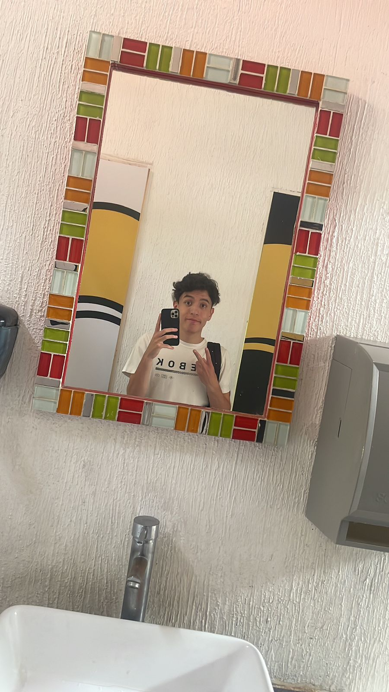

Hector Otero Caballero 

Edad: 19 años

[Practicas](Practica5.md)

**////////////////////////////**

Materia: Sistemas Operativos
Profesor: Osiel Morales
La materia trata de como comunicarse y manejarse con el sistema operativo de la computadora.

**////////////////////////////**

Materia: Proyecto de App
Profesor: Sebastian Mejia
Es esta materia nos enfocaremos en programar y realizar una aplicacion. 

**////////////////////////////**

Materia: Diseño de Videojuegos
Profesor: Hector Guerrero
En esta materia vemos la mejor forma de planear la forma de crear un videojuego, que aspectos debemos buscar primero y como debemos hacer sentir al jugador.

**///////////////////////////**

Materia: Composicion y Diseño
Profesor: Roberto Melo
Aqui conocemos sobre como debe ser un buen diseño, que debe de llevar y como debe estar compuesto.